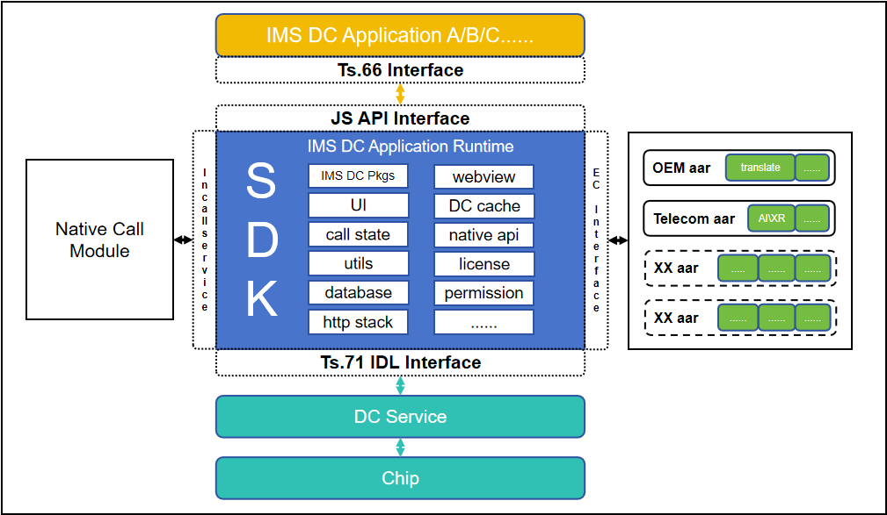
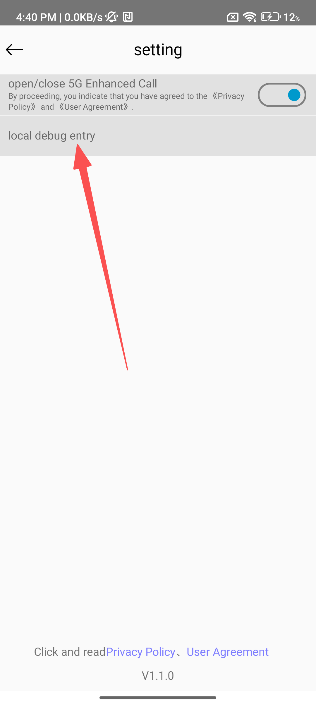

Note: This document aims to help developers understand the architectural design of the 5G New Calling Terminal SDK, facilitating rapid secondary development or direct compilation and use based on this project, and guiding the development and debugging of 5G New Calling Application.

# 5G New Calling Terminal SDK
- 5G New Calling adds a data channel (i.e., IMS Data Channel) on top of the IMS audio and video channels, integrating AR, AI, and other technologies to enable interactive information exchange during calls.

- The 5G New Calling Terminal SDK (hereinafter referred to as the SDK) is developed by the China Telecom Research Institute. After a call is established, the chip and the network negotiate the establishment of the IMS Data Channel. The terminal encapsulates the call logic for the IMS Data Channel and provides it to the SDK via AIDL interfaces (Android Interface Definition Language). The SDK serves as the runtime environment for the 5G New Calling Application (hereinafter referred to as Mini-Application) and provides a unified interface for Mini-Application to call, enabling them to operate the IMS Data Channel and other terminal capability interfaces.

## I. Features
While complying with international standards such as 3GPP and GSMA, the SDK also implements the following features：

- Closely associated with call state, manages the lifecycle of Mini-Application, providing a stable runtime environment;

- Isolated storage space for Mini-Application, ensuring data security;

- Provides interfaces for Mini-Application to operate the IMS Data Channel and other terminal capabilities;

- Supports running multiple Mini-Application simultaneously, each in an independent process;

- Supports opening and using Mini-Application after a call is established;

- Supports different operators and terminal manufacturers implementing extended capability interfaces, introducing their respective private features via AAR packages;

- Supports IMS Data Channel caching when a Mini-Application is closed during a call, avoiding re-creation of the IMS Data Channel when the Mini-Application is reopened;

- Manages sensitive JS APIs (related to permissions, data privacy, etc.) through a license verification mechanism;

- Supports simulated calls and loading local Mini-Application packages for offline debugging.

## II. Architecture Design


- Inherits InCallService: The SDK obtains call information by inheriting InCallService (https://developer.android.google.cn/reference/android/telecom/InCallService), closely associating with call state. It starts running when a call is established and releases resources when the call ends. Refer to SDK code: [core/src/main/java/com/ct/ertclib/dc/core/service/InCallServiceImpl.kt](core/src/main/java/com/ct/ertclib/dc/core/service/InCallServiceImpl.kt).  

- TS.71 IDL Interfaces: Interfaces between the SDK and the terminal. The SDK uses these interfaces to obtain the Mini-Application list, download Mini-Application packages, create IMS Data Channels and send/receive data as instructed by the Mini-Application. Refer to SDK code: [core/src/main/aidl/com/newcalllib/datachannel/V1_0](core/src/main/aidl/com/newcalllib/datachannel/V1_0).  

- Extended Capability Interfaces: To promote the unification of the 5G New Calling Terminal SDK (i.e., only one SDK runs on a terminal) while meeting the needs of operators to provide unique features for their platform's Mini-Applications, the SDK designs extended capability interfaces. This allows different operators and terminal manufacturers to introduce their respective private features via AAR packages for Mini-Applications to call.

    1) Definition of extended capability interfaces, refer to SDK code: [base/src/main/java/com/ct/ertclib/dc/base/port/ec/IEC.kt](base/src/main/java/com/ct/ertclib/dc/base/port/ec/IEC.kt);    

    2) Logic for the SDK to integrate and manage extended capabilities, refer to SDK code: [core/src/main/java/com/ct/ertclib/dc/core/manager/common/ExpandingCapacityManager.kt](core/src/main/java/com/ct/ertclib/dc/core/manager/common/ExpandingCapacityManager.kt);    

    3) Example implementation of extended capabilities by a terminal manufacturer, refer to SDK code: [oemec/src/main/java/com/ct/oemec/OemEC.kt](oemec/src/main/java/com/ct/oemec/OemEC.kt).    

- JS API Interfaces: Interfaces between Mini-Applications and the SDK, implemented using the DSBridge framework (https://github.com/wendux/DSBridge-Android). Mini-Applications use these interfaces to operate the IMS Data Channel and other terminal capabilities (including the aforementioned extended capabilities). Refer to SDK code: [core/src/main/java/com/ct/ertclib/dc/core/miniapp/bridge/JSApi.kt](core/src/main/java/com/ct/ertclib/dc/core/miniapp/bridge/JSApi.kt).  

## III. Project Structure
NewCall  
├── app/ Mini-Application list display related  
├── base/ Basic common classes, not directly referenced by other modules, referenced after being compiled into an aar  
│ ├── data/ Data structures  
│ └── port/ Interfaces  
├── build-logic/ Contains project build-related files  
├── core/ Core logic code  
│ ├── aidl/ AIDL interfaces for DC, screen sharing, extended capabilities, etc.  
│ └── core/  
│ ├── common/ Common utilities  
│ ├── constants/ Constant configurations  
│ ├── data/ Data structures  
│ ├── dispatcher/ JS API and Mini-Application service event dispatching  
│ ├── factory/ Dispatcher factory  
│ ├── manager/ Various managers  
│ ├── miniapp/ Mini-Application (management, UI, DC, etc.) related  
│ ├── picker/ Image selection  
│ ├── port/ Various interfaces  
│ ├── service/ Mini-Application, call, and other services  
│ ├── ui/ Other UI besides the Mini-Application space and Mini-Applications themselves  
│ ├── usecase/ JS API and Mini-Application service event handling  
│ └── utils/ Utility classes  
├── libs/ Third-party library files  
├── miniapp/ Mini-Application development related  
│ ├── webrtcDC/ Implements interfaces defined by GSMA TS.66 based on the SDK, can compile the webrtcDC.js library for Mini-Application integration  
│ └── demo/ Mini-Application examples  
├── oemec/ Terminal manufacturer extended capabilities  
├── script/ Build scripts  
└── testing/ Local simulation testing related  

## IV. Technology Stack
- Programming Languages: Kotlin, Java, JS

- Architecture Pattern: MVVM

- Asynchronous Processing: Coroutines + Flow

- Database: Room

- UI Framework: Jetpack Compose / XML Layouts

## V. Development Environment
- JDK Version 17

- Gradle Version 8.1

- Android SDK Version compileSdk-34, minSdk-26

- Recommended Development Tool: AndroidStudio

## VI. Build & Release
- Packaging: Currently configured for three distribution channels: Normal (Floating Ball entry version), Dialer (Dialer entry version), Local (Local debugging version, for local debugging only)
   ```bash
   ./gradlew assembleRelease 

- Terminal Adaptation:
Before network-terminal joint debugging or commercial release, terminals must be adapted according to the [《5G New Calling SDK Terminal Adaptation Specification》](/document/5G New Calling SDK Terminal Adaptation Specification.docx) to ensure the proper functioning of all SDK features.

- Release:
Terminal manufacturers integrate the SDK as a system default application and push it to adapted user terminals along with the system.
When a user is on a call, the 5G New Calling icon appears as a floating ball on the terminal's native call interface. Clicking this icon opens the 5G New Calling Mini-Application space.

## VII. Mini-Application Development & Debugging
Using the Local (Local debugging version) SDK, developers can debug Mini-Applications on ordinary Android terminals without relying on an IMS Data Channel network environment or terminal adaptation.

- Mini-Application Development: Developers need to follow web standards like HTML5, CSS3, ES6 for web development. The document [《5G New Calling IMS Data Channel JS API》](/document/5G New Calling IMS Data Channel JS API.docx) lists all interfaces exposed by the SDK to Mini-Applications. Mini-Application developers should refer to this document for development. Refer to example Mini-Application code: [miniapp/demo/IMS_DC_Mini_app_demo_source_code](miniapp/demo/IMS_DC_Mini_app_demo_source_code).  

- Mini-Application Packaging: Package the web project into an offline zip format compressed package, i.e., the Mini-Application package. The index.html and properties.json files must be in the root directory of the zip package. Refer to the example Mini-Application package: [miniapp/demo/IMS_DC_Mini_app_demo.zip](miniapp/demo/IMS_DC_Mini_app_demo.zip).  

- Mini-Application Local Debugging: Install the Local version SDK onto the phone like a regular APK. Push the Mini-Application zip package to the phone's sdcard. Then launch the "Telecom Enhanced Calling" app from the phone's home screen. After granting permissions as guided, open Settings -> Local Debugging Entry to configure and debug the Mini-Application.  


## VIII. License
This project is licensed under the Apache 2.0 License.

## IX. Contact
xuq17@chinatelecom.cn